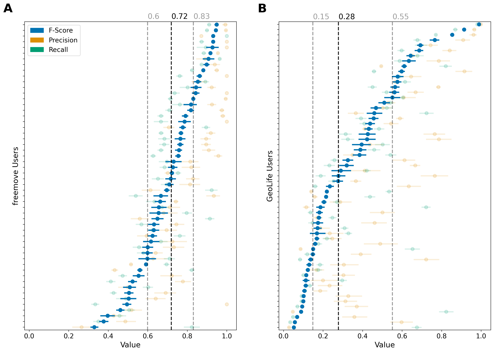

<b><a href="#abstract">Abstract</a></b>
|
<b><a href="#aata">Data</a></b>
|
<b><a href="#attack">Attack</a></b>
|
<b><a href="#evaluation">Evaluation</a></b>
|
<b><a href="#results-and-policy-implications">Results and Policy Implications</a></b>
|
<b><a href="#disclaimer">Disclaimer</a></b>
|
<b><a href="#ethics-and-disclosure">Ethics</a></b>

# Estimating the success of re-identification in GPS trajectory datasets without user identifiers

This is the corresponding repository to my Master Thesis **Estimating the success of re-identification in GPS trajectory datasets without user identifiers**. It does not contain any data files due to privacy reasons.

## Abstract

With the advent of location-based services, vast amounts of individual-level mobility data are being generated and used for a variety of applications. These data can provide valuable insights for transport planning, urban development, and research. However, they also raise privacy concerns, as the high degree of uniqueness of human mobility traces can enable adversaries to link data back to individuals even without obvious identifiers. In this thesis, I propose a novel attack to reconstruct user identifiers in GPS trajectory datasets with no user-trajectory link. Specifically, I frame the problem of trajectory-user linking as an attack and evaluate the remaining privacy risk for users in such datasets. I also assess the efficacy of truncation as a simple privacy mechanism used in practice, to evaluate whether the protection it offers is sufficient. The findings show that the risk of re-identification is significant even when personal identifiers have been removed, and that simple privacy mechanisms may not be effective in protecting user privacy. This work highlights the need for a more holistic approach to privacy in location-based services and demonstrates the importance of evaluating the privacy risks of data-sharing practices.

## Methodology

### Data

In this study, I consider two mobility datasets containing GPS trajectories, namely the widely-used [GeoLife](https://www.microsoft.com/en-us/research/publication/geolife-gps-trajectory-dataset-user-guide/) and a new non-pubic dataset collected by the *DLR MovingLab* and the researchers of the [freemove](https://www.freemove.space/en/) project. While these datasets contain other variables, this study only includes user ID, latitude, longitude, and timestamp information, with all additional information being discarded.

I apply the identical preprocessing steps to both datasets. To account for
measurement errors and artifacts in the data, I discard all trajectories that are
shorter than 200 meters or have less than 50 GPS recordings. This removes data
points that are the result of users accidentally starting to record or GPS connec-
tion issues that produced trips with only a few GPS points. Further, I remove the
longest 5% of all trips in both datasets to account for extreme outliers that are
likely the result of users not ending the recording after a trip has been completed.
Furthermore, analysis is restricted to trajectories that begin and end inside the
area of the bounding boxes depicted in Figures A.1 and A.2. These boxes contain
the urban areas of Berlin and Beijing and include a generous buffer around the
suburbs in order to mainly filter long-distance trips, e.g., flights, hence exclud-
ing only trajectories outside of the main city areas. This yields a total of 1,186
trajectories from 74 users and 5,101 trajectories from 73 users for freemove and
GeoLife, respectively.

You can explore the code for preprocessing, tessellation generation, descriptives, and loading the filtered data in these files:
- **Preprocessing**: [freemove](freemove/read_freemove.ipynb), [GeoLife](Geolife/read_geolife.ipynb)
- **Tessellation Generation**: [Berlin](freemove/generate_tessellation.ipynb), [Beijing](Geolife/generate_tessellation_geolife.ipynb)
- [Data Loaders](data_loader.py)
- **Descriptives**: [freemove](freemove/freemove_descriptives.ipynb), [GeoLife](Geolife/geolife_descriptives.ipynb)

The GeoLife dataset can downloaded via this [link](https://www.microsoft.com/en-us/research/publication/geolife-gps-trajectory-dataset-user-guide/). The freemove dataset is not public.

### Attack

In this work I describe a technique to reconstruct user identifiers in GPS mobility datasets with no trajectory-user link by combining a set of assumptions about the day-to-day mobility patterns of urban residents. These include combining trips that seem to be continuations of one another and identifying potential home locations (HLs) of individuals. In addition, I leverage the information content of location co-visits to combine initially identified groups of trajectories and refine the cluster assignments.

An overview of the HL assignment step can be see from this flowchart.

During this procedure I use the Longest Common Subsequence (LCSS) to identifiy similar trajectories. I use a the maximum of the raw and reversed metric as illustrated in the following.

Additionally, during evaluation, I apply a obfuscation technique to the raw data in order to assess the efficacy of this measure against the introduced attack. The following illustration explains the truncation method that is applied.

You can explore the code for running the attack, the individual attack steps, and for obfuscating the data in these files:
- **Running Concatenation and HL assignment for inital clustering**: [freemove](freemove/attack_freemove.ipynb), [GeoLife](Geolife/attack_geolife.ipynb)
- **Using TF-IDF Refinement**: [freemove example](Recursive_Search_freemove.ipynb), [GeoLife example](Recursive_Search_geolife.ipynb)
- **Individual methods used during the attack**: [here](attack.ipynb)
- **Obfuscation of data**: [freemove](freemove/freemove_create_private_data.ipynb), [GeoLife](Geolife/create_private_data_geolife.ipynb)

### Baseline

During evaluation of the overall performance, the outlined attack is compared to the E2DTC deep clustering framework introduced by [(Fang et al., 2021)](https://ieeexplore.ieee.org/document/9458936). Their framework has shown state-of-the-art performance in clustering across three datasets including GeoLife.

I apply the same preprocessing to the data as outlined in the data section and otherwise use the same parameters during training as Fang et al. (2021) outlined in
their paper for the GeoLife dataset with a train-test split of 85% and 15% during pretraining of the trajectory representations. I am using their implementation that is well-documented in the accompanying repository, you can find [here](https://github.com/ZJU-DAILY/E2DTC). The metric outputs during pretraining and training as well as the parameters and final results can be found here for [freemove](Experiments/E2DTC_freemove/2104) and [GeoLife](Experiments/E2DTC_geolife/2104).

The steadily decreasing loss curves below show that the model is successful in learning trajectory representations for both datasets, but fails to improve on the initial clustering performance during training. This illustrates, as expected, the limited suitability of this method for clustering users only taking trajectory similarity into account.

Figures showing the learning curves on both datasets can be found here for [freemove](Figures/e2dtc_freemove_curves.png) and [GeoLife](Figures/e2dtc_geolife_curves.png).

## Evaluation

given the trajectory assignments found with my attack,
I evaluate the risk of re-identification for individuals by considering a scenario in which an attacker is given a set randomly chosen
spatio-temporal points part of the trajectories produced by a user. In this thesis I set the number of points to four drawing on extant literature.
An example of this evaluation method is illustrated in the figure below.

### Evaluation on Raw Data

The figure below shows the performance increments across the three main
steps of the attack. I observe that there is a monotonous increase in overall cluster-
ing performance for both datasets. The HL assignment steps seems to result in the biggest increment.

Incremental performance across individual heuristics of attack with
respect to (A) AMI and (B) ARI.

### Characterization of re-identification risk

Overall, the results suggest that
users in GPS trajectory datasets where no user identifier is available, are subject
to a significant risk of re-identification with some individuals being particularly
vulnerable.

F-score, precision, and recall across 100 random samples of p =
4 points for every user in (A) freemove and (B) GeoLife. Users are sorted by
ascending F-score. Vertical lines indicate the median, lower, and upper F-score
quartiles.

### Investigation of characteristics impacting users' vulnerability

Mean F-scores given random points Lp=4 across mobility character-
istics for users in (A) freemove and (B) GeoLife.

### Evaluation of Obfuscated Data

Median F-scores across users for freemove and GeoLife on raw and
obfuscated datasets given four points with grid cell sizes 200m and 500m.

You can explore the code for running the re-identification analysis as well as the evaluation via the following files:
- [**Re-identification analysis**](reident_analysis.ipynb)
- [**Evaluation**](evaluation.ipynb)

## Results and Policy Implications

I estimate the risk of re-identification for individuals part of GPS trajectory datasets with no user-trajectory link. I do so by developing a new attack methodology to reconstruct user identifiers in mobility micro-data and define the underlying trajectory clustering problem formally. This attack comprises a series of heuristics grounded in assumptions about the daily mobility behavior of urban residents using no outside information other than the spatio-temporal trajectories themselves. Evaluating my approach on two real-world datasets from Berlin and Beijing, I show that four random points are enough to re-identify a significant share of individuals' trajectories. Finally, I assess the efficacy of a widely-used obfuscation technique to protect users' privacy and demonstrate its limited reliability across datasets.

These results raise important concerns about the limited privacy protection achieved with simple mechanisms such as discarding the user identifier. Considering the likely development of more powerful attacks in the future, I am convinced that this work forms an important baseline for mobility privacy research. My findings also highlight the need for a more holistic approach to privacy in location-based services that acknowledges the inherent trade-off between anonymity and utility in data-sharing.

From a policy standpoint, it is important to think about new models of data governance that acknowledge the inherent shortcomings of existing privacy-preserving techniques and account for the elevated relevance of the issue in the near future. One promising approach is to implement user-centric trusted entities that handle the access management and sharing of personal data on a case-by-case basis. This enables users to see who is using their data for what purpose and allows them to revoke access rights if necessary. Convincing examples of such concepts already implemented in practice are the [MyData](https://www.mydata.org/publication/mydata-introduction-to-human-centric-use-of-personal-data/) initiative supported by the Finnish government and the private project [Posmo](https://posmo.coop/about-us/wer-wir-sind) based in Zurich.  

## Disclaimer

I have used GitHub co-pilot during implementation of the outlined research and relied on it for suggesting code writing comments and plotting. 

## Ethics and Disclosure

Given the potential real-world implications of the analysis, I will revoke public access to this repository after grading. This is due to the possibility that carrying out the described attack on publicly accessible datasets could jeopardize the privacy of the individuals who provided the data.
